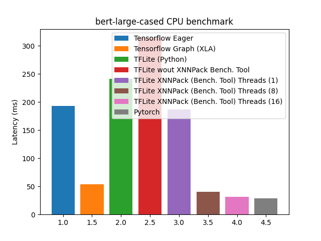

# tensorflow-hf-benchmark

This repository contains benchmarks for evaluating the performance of TensorFlow models from the Hugging Face Transformers library.It provides comprehensive comparison of model performance with plots. Currently the repository only support for sequence classification tasks.

Supported Features of TensorFlow Hugging Face Benchmarks Repository

* Benchmarks for **TensorFlow eager execution**
* Benchmarks for **TensorFlow XLA**
* Benchmarks for **PyTorch**
* **TFLite export support**
* Benchmarks for **TensorFlow Lite with XNNPACK**
* Benchmarks for **TensorFlow Lite without XNNPACK**

## Todo
* [ ] Quantization benchmarks
* [ ] Pruning tensorflow models using INC

## Installation

TBA

## Results
The results presented are computed on **AWS C6I.X8large** EC2 instance

### 1. Bert base (BS 1 SL 8)
-------------------------

| Description | Latency (ms) |
| --- | --- |
| Tensorflow Eager  | 95.13 |
| Tensorflow Graph (XLA) | 22.55 |
| TFLite (Python) | 50.18 |
| TFLite wout XNNPack (Bench. Tool) | 78.94 |
| TFLite XNNPack (Bench. Tool) Threads (1) | 50.18|
| TFLite XNNPack (Bench. Tool) Threads (8) | 12.32 |
| TFLite XNNPack (Bench. Tool) Threads (16) | 10.47 |
| Pytorch | 10.63 |

  

### 2. Bert large (BS 1 SL 8)
-------------------------

| Description | Latency (ms) |
| --- | --- |
| Tensorflow Eager  | 193.38 |
| Tensorflow Graph (XLA) | 53.64 |
| TFLite (Python) | 241.51 |
| TFLite wout XNNPack (Bench. Tool) | 314.21 |
| TFLite XNNPack (Bench. Tool) Threads (1) | 187.17|
| TFLite XNNPack (Bench. Tool) Threads (8) | 40.05 |
| TFLite XNNPack (Bench. Tool) Threads (16) | 31.11 |
| Pytorch | 28.65 |

  

-------------------------

## Tensorflow Model Optimization Limitations
The section mentions the limitations of the features mentioned in [https://www.tensorflow.org/model_optimization](https://www.tensorflow.org/model_optimization) as well as other shortcomings.

* [**Pruning**](https://www.tensorflow.org/model_optimization/guide/pruning) - The pruning currently doesn't support subclassed tensorflow models. Hence, we cannot use it for the hugging face models. For subclass models, since keras doesn't support cloning, it still don't have a model-level API. Alternative is to re-construct the model and wrapper the layers to prune with the pruning API. See [tensorflow/model-optimization/issues/155](https://github.com/tensorflow/model-optimization/issues/155) for more information.
* **TFLite Python Support (Num threads)** - Mulithreaded execution have significant performance gains in some scenarios. However, setting `num_threads` in Python interpreter does not work. See [tensorflow/tensorflow/issues/52076](https://github.com/tensorflow/tensorflow/issues/52076) for more information.
